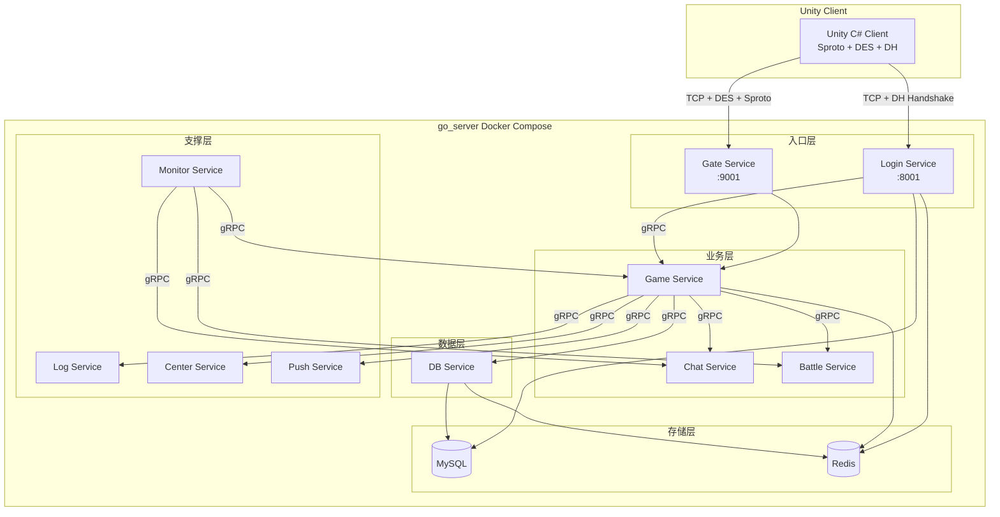
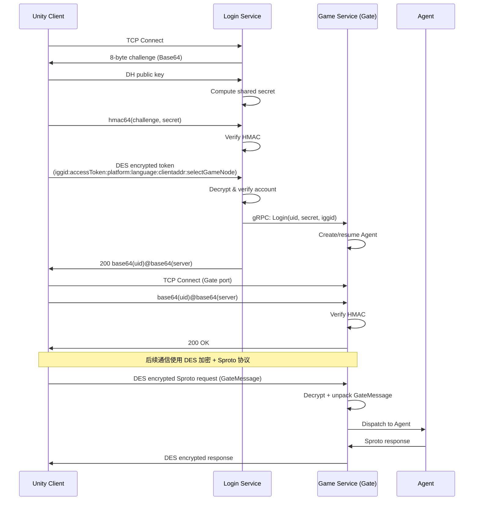
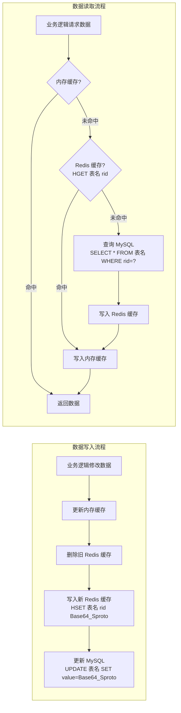
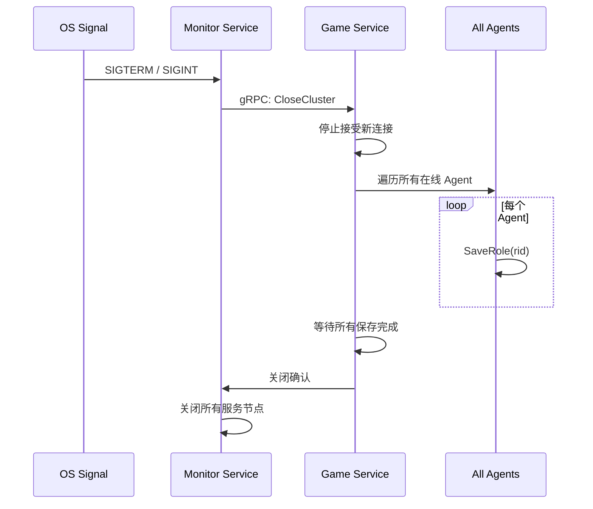

# 技术设计文档：Lua 服务器翻译为 Go 语言实现

## 概述

本设计文档描述将基于 Skynet 框架的 Lua 游戏服务器（rok_server）完整翻译为 Go 语言实现的技术方案。Go 服务器（go_server）将在项目根目录下独立构建，使用 Docker 管理部署，与现有 Unity C# 客户端（Sproto 协议、DES 加密、DH 握手）完全对接。

### 设计目标

1. 功能等价：Go 服务器的所有协议、数据格式、业务逻辑与 Lua 服务器完全一致
2. 协议兼容：客户端无需任何修改即可连接 Go 服务器
3. 数据兼容：Go 服务器可直接读写 Lua 服务器的 MySQL/Redis 数据
4. 独立部署：通过 Docker Compose 一键启动全部服务节点和依赖

### 关键设计决策

| 决策项 | Lua 服务器 | Go 服务器 | 理由 |
|--------|-----------|----------|------|
| 并发模型 | Skynet Actor（coroutine） | goroutine + channel | Go 原生并发模型，性能更优 |
| 服务间通信 | Skynet Cluster RPC | gRPC（内部）| 类型安全、高性能、生态成熟 |
| 客户端协议 | Sproto over TCP | Sproto over TCP（完全兼容）| 必须与客户端兼容 |
| 数据序列化 | Sproto pencode/pdecode | 自实现 Sproto 编解码 | 必须与 Lua 数据格式兼容 |
| 配置加载 | Lua table | Go struct + CSV/JSON 解析 | 类型安全 |
| 日志框架 | skynet.error + 文件 | zerolog（结构化日志）| 高性能、JSON 输出 |
| 定时器 | skynet.timeout | time.AfterFunc + 时间轮 | Go 标准库 + 高精度定时 |

## 架构

### 整体架构图



### 服务节点职责

| 服务节点 | 对应 Lua 服务 | 职责 | 端口 |
|---------|-------------|------|------|
| Login Service | login_server | DH 握手、Token 认证、账号管理 | 8001 |
| Game Service | game_server | 游戏核心逻辑、Gate 网关、Agent 管理 | 9001(Gate) |
| Chat Service | chat_server | 聊天频道、消息广播、私聊 | 内部 gRPC |
| Battle Service | battle_server | 回合制战斗计算、Buff/技能 | 内部 gRPC |
| DB Service | db_server | 数据持久化、Entity 框架、Redis 缓存 | 内部 gRPC |
| Log Service | log_server | 运营日志收集和存储 | 内部 gRPC |
| Center Service | center_server | 跨服查询、服务器列表 | 内部 gRPC |
| Monitor Service | monitor_server | 集群监控、配置重载、关闭协调 | HTTP API |
| Push Service | push_server | 离线推送通知 | 内部 gRPC |

### 客户端连接流程



## 组件与接口

### 项目目录结构

```
go_server/
├── cmd/                          # 各服务入口
│   ├── login/main.go
│   ├── game/main.go
│   ├── chat/main.go
│   ├── battle/main.go
│   ├── db/main.go
│   ├── log/main.go
│   ├── center/main.go
│   ├── monitor/main.go
│   └── push/main.go
├── internal/                     # 内部包（不对外暴露）
│   ├── login/                    # Login Service 业务逻辑
│   ├── game/                     # Game Service 业务逻辑
│   │   ├── gate/                 # Gate 网关
│   │   ├── agent/                # Agent 玩家会话
│   │   ├── role/                 # 角色管理
│   │   ├── building/             # 建筑系统
│   │   ├── army/                 # 军队系统
│   │   ├── hero/                 # 英雄系统
│   │   ├── item/                 # 道具系统
│   │   ├── email/                # 邮件系统
│   │   ├── guild/                # 联盟系统
│   │   ├── battle/               # 战斗逻辑（创建、回调、报告）
│   │   ├── map/                  # 大世界地图
│   │   ├── task/                 # 任务系统
│   │   ├── activity/             # 活动系统
│   │   ├── recharge/             # 充值商城
│   │   ├── technology/           # 科技研究
│   │   ├── monument/             # 纪念碑系统
│   │   ├── holyland/             # 圣地系统
│   │   ├── expedition/           # 远征系统
│   │   └── timer/                # 角色定时器
│   ├── chat/                     # Chat Service 业务逻辑
│   ├── battle_svc/               # Battle Service 战斗引擎
│   ├── db/                       # DB Service 数据管理
│   ├── log_svc/                  # Log Service 日志收集
│   ├── center/                   # Center Service 跨服
│   ├── monitor/                  # Monitor Service 监控
│   └── push/                     # Push Service 推送
├── pkg/                          # 可复用公共包
│   ├── sproto/                   # Sproto 编解码器
│   ├── crypt/                    # DES/DH/HMAC/Base64 加密库
│   ├── entity/                   # Entity 数据管理框架
│   ├── config/                   # 配置表加载器
│   ├── protocol/                 # 协议定义和注册
│   ├── network/                  # TCP 网络库
│   ├── timer/                    # 定时器框架
│   ├── aoi/                      # AOI 兴趣区域
│   ├── navmesh/                  # NavMesh 寻路
│   ├── astar/                    # A* 路径计算
│   ├── rank/                     # 排行榜管理
│   ├── errcode/                  # 错误码定义
│   ├── enum/                     # 枚举定义
│   └── logger/                   # 日志封装
├── configs/                      # 配置文件
│   ├── login.yaml
│   ├── game.yaml
│   ├── chat.yaml
│   ├── battle.yaml
│   ├── db.yaml
│   ├── log.yaml
│   ├── center.yaml
│   ├── monitor.yaml
│   └── push.yaml
├── docs/                         # HTML 服务器文档
├── scripts/                      # 运维脚本
│   ├── backup.sh
│   └── restore.sh
├── deployments/                  # Docker 相关
│   ├── docker-compose.yml
│   ├── Dockerfile
│   └── sql/
│       ├── init.sql
│       └── migrations/
├── go.mod
├── go.sum
└── Makefile
```


### 核心组件接口设计

#### 1. Sproto 编解码器（pkg/sproto）

Sproto 是本项目的核心协议格式，必须与 Lua 服务器的 sprotoparser/sprotoloader 完全兼容。

```go
// Sproto 编解码器核心接口
type Sproto struct {
    // 从 .sproto 文件解析协议定义
}

// 从 .sproto 文本解析协议定义
func Parse(schema string) (*Sproto, error)

// 编码：Go struct → Sproto binary
func (sp *Sproto) Encode(typeName string, data interface{}) ([]byte, error)

// 解码：Sproto binary → Go struct/map
func (sp *Sproto) Decode(typeName string, data []byte) (map[string]interface{}, error)

// Pack 编码（pencode）：对 Sproto binary 进行压缩打包
func Pack(data []byte) []byte

// Unpack 解码（pdecode）：解压 Sproto packed data
func Unpack(data []byte) []byte

// RPC Host：处理客户端请求
type Host struct {
    sp       *Sproto
    sessions map[int]string // session → protocol name
}

func NewHost(sp *Sproto) *Host
func (h *Host) Dispatch(data []byte) (*Request, error)
func (h *Host) PackResponse(session int, data interface{}) ([]byte, error)

// RPC Attach：发送服务器推送
type Attach struct {
    sp *Sproto
}

func NewAttach(sp *Sproto) *Attach
func (a *Attach) PackRequest(name string, data interface{}, session int) ([]byte, error)
```

#### 2. 加密库（pkg/crypt）

必须与 Skynet crypt 库的实现完全兼容，确保客户端无需修改。

```go
// DH 密钥交换（兼容 Skynet dhexchange/dhsecret）
func DHExchange(key uint64) uint64
func DHSecret(myKey, otherKey uint64) uint64

// DES 加密解密（兼容 Skynet desencode/desdecode，8 字节密钥）
func DESEncode(key [8]byte, plaintext []byte) []byte
func DESDecode(key [8]byte, ciphertext []byte) []byte

// HMAC 签名（兼容 Skynet hmac64/hashkey）
func HMAC64(key uint64, text uint64) uint64
func HashKey(text string) uint64

// Base64 编解码（兼容 Skynet base64encode/base64decode）
func Base64Encode(data []byte) string
func Base64Decode(s string) ([]byte, error)

// DES Codec：有状态的加解密编解码器（用于 Gate 连接）
type DESCodec struct {
    encryptKey [8]byte
    decryptKey [8]byte
}

func NewDESCodec(secret uint64) *DESCodec
func (c *DESCodec) Encrypt(data []byte) []byte
func (c *DESCodec) Decrypt(data []byte) []byte
```

#### 3. Entity 数据管理框架（pkg/entity）

翻译 Lua 服务器的 EntityImpl 架构，实现三层数据访问：内存 → Redis → MySQL。

```go
// 数据类型分类
type TableType int
const (
    TableTypeConfig TableType = iota // 配置数据（只读）
    TableTypeCommon                   // 全局共享数据
    TableTypeUser                     // 用户数据
    TableTypeRole                     // 角色数据
)

// 表配置定义
type TableConfig struct {
    Name      string    // 表名
    Key       string    // 主键列名
    Value     string    // 值列名（默认 "value"）
    TableType TableType
    NoLoad    bool      // 是否不随角色加载
    NoJSON    bool      // 是否不写入 JSON 列
    AllJSON   bool      // 是否始终写入 JSON 列
    SubAttr   string    // 子属性名（MultiEntity 用）
    SubIndex  string    // 子索引名（MultiEntity 用）
}

// EntityImpl 核心实现
type EntityImpl struct {
    mysqlPool *sql.DB
    redisPool *redis.Client
    sproto    *sproto.Sproto
    configs   map[string]*TableConfig
}

// CRUD 操作接口
func (e *EntityImpl) Load(tableName string, key interface{}) (map[string]interface{}, error)
func (e *EntityImpl) Add(tableName string, key interface{}, data map[string]interface{}) error
func (e *EntityImpl) Update(tableName string, key interface{}, data map[string]interface{}) error
func (e *EntityImpl) Delete(tableName string, key interface{}) error

// SingleEntity：Common 类型，启动时全量加载
type SingleEntity struct {
    impl      *EntityImpl
    tableName string
    records   sync.Map // key → data
}

// MultiEntity：Role 类型子表，按子索引增删改查
type MultiEntity struct {
    impl      *EntityImpl
    tableName string
    subAttr   string
    subIndex  string
    records   sync.Map // rid → map[subIndex]data
}

// EntityLoad：批量操作
func LoadRole(rid int64) error   // 加载角色全部数据表
func SaveRole(rid int64) error   // 保存角色全部数据表
func UnloadRole(rid int64) error // 卸载角色数据
func DeleteRole(rid int64) error // 删除角色全部数据
```

#### 4. 网络层（pkg/network）

```go
// TCP Server：支持 2 字节大端序包头协议
type TCPServer struct {
    listener net.Listener
    handler  ConnectionHandler
}

type ConnectionHandler interface {
    OnConnect(conn *Connection)
    OnMessage(conn *Connection, data []byte)
    OnDisconnect(conn *Connection)
}

type Connection struct {
    fd       int
    conn     net.Conn
    codec    *DESCodec // DES 加解密（握手后设置）
    userData interface{}
}

// 读取一个完整包：2 字节大端序长度 + 包体
func (c *Connection) ReadPacket() ([]byte, error)
// 发送一个包：自动添加 2 字节大端序长度头
func (c *Connection) WritePacket(data []byte) error
```

#### 5. Agent 玩家会话（internal/game/agent）

```go
// Agent 状态
type AgentState int
const (
    StatePreLogin AgentState = iota // 预登录
    StateOK                          // 在线
    StateAFK                         // 离线等待
)

type Agent struct {
    uid       int64
    rid       int64
    state     AgentState
    conn      *network.Connection
    codec     *crypt.DESCodec
    pushQueue chan []byte      // 推送消息队列
    reqQueue  chan *Request    // 请求队列（保证顺序处理）
    afkTimer  *time.Timer     // 离线定时器
    roleData  *RoleData       // 角色数据缓存
    mu        sync.RWMutex
}

func (a *Agent) HandleRequest(msg []byte) error
func (a *Agent) Push(protoName string, data interface{}) error
func (a *Agent) EnterAFK()
func (a *Agent) ResumeFromAFK(conn *network.Connection)
func (a *Agent) Logout()
```

#### 6. Gate 网关（internal/game/gate）

```go
type Gate struct {
    server     *network.TCPServer
    agents     sync.Map // username → *Agent
    handshakes sync.Map // fd → addr
    host       *sproto.Host
    attach     *sproto.Attach
}

// 处理握手认证
func (g *Gate) handleAuth(conn *network.Connection, message []byte) error
// 处理游戏请求：解密 → 解包 GateMessage → 分发到 Agent
func (g *Gate) handleRequest(conn *network.Connection, message []byte) error
// 登录：由 Login Service 通过 gRPC 调用
func (g *Gate) Login(uid int64, secret []byte, iggid string) (subid int64, err error)
// 登出
func (g *Gate) Logout(username string)
```

#### 7. 排行榜管理（pkg/rank）

```go
type RankManager struct {
    redisClient *redis.Client
    mysqlDB     *sql.DB
    rankTypes   map[string]*RankType
}

type RankType struct {
    Name      string // MySQL 表名
    RankType  int    // 排行榜类型枚举
    MultiTable bool  // 是否联盟子排行榜
}

// Redis Sorted Set 操作
func (rm *RankManager) UpdateScore(key string, member string, score float64) error
func (rm *RankManager) QueryRank(key string, page, pageSize int) ([]RankEntry, error)
func (rm *RankManager) GetMemberRank(key string, member string) (int64, error)
func (rm *RankManager) RemoveMember(key string, member string) error

// 双写：Redis + MySQL
func (rm *RankManager) UpdateDB(key, member string, score float64, lastScore float64) error
// 启动时从 MySQL 加载到 Redis
func (rm *RankManager) Init() error
```

#### 8. 配置表加载器（pkg/config）

```go
type ConfigLoader struct {
    configPath string
    tables     sync.Map // tableName → []map[string]interface{}
}

// 启动时加载所有配置表
func (cl *ConfigLoader) LoadAll() error
// 按 ID 查询单条记录
func (cl *ConfigLoader) Get(tableName string, id int) (map[string]interface{}, bool)
// 遍历全表
func (cl *ConfigLoader) Range(tableName string, fn func(id int, row map[string]interface{}) bool)
// 热重载
func (cl *ConfigLoader) Reload() error
```

#### 9. 服务间 gRPC 接口

```protobuf
// 内部 RPC 服务定义（简化示意）

service GameInternal {
    rpc Login(LoginRequest) returns (LoginResponse);
    rpc Logout(LogoutRequest) returns (LogoutResponse);
    rpc KickPlayer(KickRequest) returns (KickResponse);
}

service ChatInternal {
    rpc SendMessage(ChatMessage) returns (ChatResponse);
    rpc JoinChannel(JoinChannelRequest) returns (JoinChannelResponse);
    rpc LeaveChannel(LeaveChannelRequest) returns (LeaveChannelResponse);
}

service BattleInternal {
    rpc CreateBattle(BattleCreateRequest) returns (BattleCreateResponse);
    rpc JoinBattle(BattleJoinRequest) returns (BattleJoinResponse);
    rpc LeaveBattle(BattleLeaveRequest) returns (BattleLeaveResponse);
}

service DBInternal {
    rpc Load(LoadRequest) returns (LoadResponse);
    rpc Save(SaveRequest) returns (SaveResponse);
    rpc Delete(DeleteRequest) returns (DeleteResponse);
}

service LogInternal {
    rpc WriteLog(LogEntry) returns (LogResponse);
}

service MonitorInternal {
    rpc ReloadConfig(ReloadRequest) returns (ReloadResponse);
    rpc CloseCluster(CloseRequest) returns (CloseResponse);
    rpc GetStatus(StatusRequest) returns (StatusResponse);
}
```


## 数据模型

### 数据库架构

Go 服务器使用与 Lua 服务器完全兼容的数据库架构：MySQL 作为主存储，Redis 作为缓存和排行榜。

#### MySQL 表结构

所有数据表统一使用三列结构：

```sql
CREATE TABLE IF NOT EXISTS `表名` (
    `主键列` VARCHAR(255) 或 BIGINT NOT NULL,  -- 根据 key 类型
    `value` LONGTEXT,                           -- Base64 编码的 Sproto 序列化数据
    `json`  LONGTEXT,                           -- JSON 格式可读数据（debug 模式）
    PRIMARY KEY (`主键列`)
) ENGINE=InnoDB DEFAULT CHARSET=utf8;
```

#### Common 类型表（全局共享，启动时全量加载）

| 表名 | 主键 | 主键类型 | 说明 |
|------|------|---------|------|
| c_pkid | id | VARCHAR | 主键 ID 分配 |
| c_account | iggid | VARCHAR | 玩家账号信息 |
| c_recommend | serverNode | VARCHAR | 推荐服务器 |
| c_map_object | id | BIGINT | 地图对象 |
| c_refresh | id | BIGINT | 刷新信息 |
| c_activity | id | BIGINT | 活动时间 |
| c_guild | guildId | BIGINT | 联盟信息 |
| c_guild_name | name | VARCHAR | 联盟名称唯一性 |
| c_guild_abbname | abbreviationName | VARCHAR | 联盟简称唯一性 |
| c_role_name | name | VARCHAR | 角色名称唯一性 |
| c_guild_building | guildId | BIGINT | 联盟建筑（MultiEntity） |
| c_email_content | emailIndex | BIGINT | 邮件内容 |
| c_chat | channelType | BIGINT | 聊天信息 |
| c_chat_guild | guildId | BIGINT | 联盟聊天 |
| c_monument | id | BIGINT | 纪念碑信息 |
| c_expeditionShop | id | BIGINT | 远征商店 |
| c_hallActivity | activityId | BIGINT | 地狱活动 |
| c_recharge | id | BIGINT | 充值信息 |
| c_system | id | BIGINT | 系统配置 |
| c_systemmail | id | BIGINT | 系统邮件（nojson） |
| c_king | id | BIGINT | 国王信息 |
| c_holy_land | id | BIGINT | 圣地信息 |

#### Role 类型表（按角色 rid 分片，按需加载）

| 表名 | 主键 | 说明 | 子属性/子索引 |
|------|------|------|-------------|
| d_role | rid | 角色主属性（alljson=true，140+ 字段） | - |
| d_user | uid | 用户角色映射（noLoad=true） | - |
| d_building | rid | 角色建筑 | buildInfo / buildingIndex |
| d_item | rid | 角色道具 | itemInfo / itemIndex |
| d_email | rid | 角色邮件 | emailInfo / emailIndex |
| d_hero | rid | 角色英雄 | heroInfo / heroId |
| d_army | rid | 角色军队 | armyInfo / armyIndex |
| d_scouts | rid | 角色斥候 | scoutsInfo / scoutsIndex |
| d_task | rid | 角色任务 | taskInfo / taskId |
| d_transport | rid | 角色运输车 | transportInfo / transportIndex |
| d_chat | rid | 角色私聊 | privateChatInfo / rid |

#### 排行榜表（Redis Sorted Set + MySQL 双写）

| 表名 | member | 说明 |
|------|--------|------|
| c_role_power | rid | 个人战力 |
| c_townhall | rid | 市政厅等级 |
| c_role_kill | rid | 个人击杀 |
| c_role_collect_res | rid | 个人采集 |
| c_combat_first | rid | 战力至上 |
| c_rise_up | rid | 拔地而起 |
| c_reserve | rid | 战略储备 |
| c_kill_type | rid_type | 最强执政官 |
| c_expedition | rid | 远征 |
| c_alliance_power | guildId | 联盟战力 |
| c_alliance_kill | guildId | 联盟击杀 |
| c_alliance_flag | guildId | 联盟旗帜 |
| c_hell_activity_rank | rid | 地狱活动 |
| c_tribe_king | rid | 部落之王 |
| c_fight_horn | rid | 战争号角个人 |
| c_fight_horn_alliance | guildId | 战争号角联盟 |

#### 联盟子排行榜表（key=guildId，子属性按 rid 索引）

| 表名 | 说明 |
|------|------|
| c_guild_role_power | 联盟成员战力 |
| c_guild_role_kill | 联盟成员击杀 |
| c_guild_role_donate | 联盟成员捐献 |
| c_guild_role_build | 联盟成员建造 |
| c_guild_role_help | 联盟成员帮助 |
| c_guild_resource_help | 联盟成员资源帮助 |
| c_guild_shop | 联盟商店 |
| c_guild_message_board | 联盟留言板 |
| c_guild_gift | 联盟礼物 |

### Redis 数据结构

| 数据类型 | Key 格式 | 结构 | 说明 |
|---------|---------|------|------|
| Entity 缓存 | 表名（如 d_role） | Hash: field=rid, value=Base64(Sproto) | Entity 数据缓存 |
| 主键 ID | pkidkey, petkey, itemkey 等 | String: 当前 ID 值 | 原子递增 |
| 表最大 ID | 表名:主键列名 | String: 最大 ID | Entity newId |
| 排行榜 | 排行榜名（如 role_power） | Sorted Set: member=rid, score=分数 | 实时排名 |
| 排行榜副本 | 排行榜名_copy | Sorted Set | 上次排名快照 |
| 游服角色数 | gameRoleCount_游服名 | String: 数量 | 角色计数 |

### Redis 实例分配

| 实例 | DB 编号 | 用途 |
|------|--------|------|
| db_server | db0 | Entity 数据缓存、排行榜 |
| game_server | db2 | 游戏运行时缓存 |
| login_server | db4 | 登录认证缓存 |

### 数据流转图



### Sproto 数据序列化流程

```
Go struct → Sproto Encode → Sproto Pack (pencode) → Base64 Encode → MySQL value 列
MySQL value 列 → Base64 Decode → Sproto Unpack (pdecode) → Sproto Decode → Go struct
```

### Docker Compose 服务编排

```yaml
# 简化示意
services:
  mysql:
    image: mysql:8.0
    environment:
      MYSQL_ROOT_PASSWORD: ${MYSQL_PASSWORD}
      MYSQL_DATABASE: ig
    volumes:
      - mysql_data:/var/lib/mysql
      - ./sql/init.sql:/docker-entrypoint-initdb.d/init.sql
    healthcheck:
      test: ["CMD", "mysqladmin", "ping", "-h", "localhost"]

  redis:
    image: redis:7-alpine
    command: redis-server --appendonly yes
    volumes:
      - redis_data:/data

  login:
    build: .
    command: /app/login
    depends_on:
      mysql: { condition: service_healthy }
      redis: { condition: service_started }
    ports:
      - "8001:8001"

  game:
    build: .
    command: /app/game
    depends_on:
      mysql: { condition: service_healthy }
      redis: { condition: service_started }
    ports:
      - "9001:9001"

  chat:
    build: .
    command: /app/chat
    depends_on:
      redis: { condition: service_started }

  battle:
    build: .
    command: /app/battle

  db:
    build: .
    command: /app/db
    depends_on:
      mysql: { condition: service_healthy }
      redis: { condition: service_started }

  log:
    build: .
    command: /app/log

  center:
    build: .
    command: /app/center

  monitor:
    build: .
    command: /app/monitor
    ports:
      - "8080:8080"

  push:
    build: .
    command: /app/push
```


## 正确性属性（Correctness Properties）

*属性是一种在系统所有有效执行中都应成立的特征或行为——本质上是关于系统应该做什么的形式化陈述。属性是人类可读规范与机器可验证正确性保证之间的桥梁。*

### Property 1: Sproto 编解码往返

*For any* 有效的 Sproto 消息（包含 integer、string、boolean、binary、嵌套结构体、数组等所有数据类型），对其进行 Sproto 编码（Encode）后再解码（Decode），应产生与原始消息等价的对象。同样，对编码后的数据进行 Pack（pencode）再 Unpack（pdecode），应产生与 Pack 前相同的二进制数据。

**Validates: Requirements 5.1, 5.4, 5.5, 5.7, 33.6**

### Property 2: Sproto RPC Host/Attach 往返

*For any* 有效的 Sproto RPC 请求（包含协议名、session ID 和请求数据），通过 Attach 打包请求后，Host 应能正确分发并解析出原始的协议名、session ID 和请求数据。同样，Host 打包的响应通过 Attach 解析后应得到原始响应数据。

**Validates: Requirements 5.2**

### Property 3: GateMessage 封装/解封装往返

*For any* 包含 1 到 N 个子消息的 GateMessage，封装（pack）后再解封装（unpack），应产生与原始子消息列表等价的结果，且子消息的顺序和内容完全保持。

**Validates: Requirements 5.3**

### Property 4: DES 加解密往返

*For any* 随机生成的 8 字节密钥和任意长度的明文数据，DES 加密（DESEncode）后再解密（DESDecode）应产生与原始明文完全相同的数据。

**Validates: Requirements 3.4, 4.5, 6.2, 6.5**

### Property 5: DH 密钥交换共享密钥一致性

*For any* 两个随机生成的私钥 a 和 b，Alice 使用 DHExchange(a) 生成公钥 A，Bob 使用 DHExchange(b) 生成公钥 B，则 DHSecret(a, B) 应等于 DHSecret(b, A)（双方计算的共享密钥相同）。

**Validates: Requirements 3.2, 6.1**

### Property 6: HMAC 签名确定性

*For any* 随机生成的密钥和文本，HMAC64(key, text) 的结果应是确定性的（相同输入产生相同输出），且 HashKey 函数对相同字符串应产生相同的哈希值。

**Validates: Requirements 3.3, 4.2, 6.3**

### Property 7: Base64 编解码往返

*For any* 任意字节序列，Base64Encode 后再 Base64Decode 应产生与原始字节序列完全相同的数据。

**Validates: Requirements 6.4**

### Property 8: 网络包编解码往返

*For any* 有效的网络数据包（包含 Sproto 消息体、4 字节 game_session、1 字节压缩标志），使用 2 字节大端序包头编码后再解码，应能正确还原消息体、game_session 和压缩标志。

**Validates: Requirements 4.3, 4.4**

### Property 9: 登录响应格式正确性

*For any* 有效的登录参数组合（uid、servername、subid、connectip、connectport、connectrealip、gamenode），格式化后的响应字符串应符合 `200 base64(uid)@base64(servername)#base64(subid)@base64(connectip)@base64(connectport)@base64(connectrealip)@base64(gamenode)@base64(uid)` 格式，且对响应中的每个 Base64 字段解码后应得到原始参数值。

**Validates: Requirements 3.6**

### Property 10: Agent 状态机转换正确性

*For any* Agent 实例和有效的事件序列（认证成功、断开连接、重新连接），Agent 的状态转换应满足：PRELOGIN → OK（认证成功）、OK → AFK（断开连接）、AFK → OK（重新连接），且不存在非法的状态转换路径。

**Validates: Requirements 7.1, 7.2, 7.3, 7.5**

### Property 11: Agent 请求队列顺序保证

*For any* 同一 Agent 的请求序列，请求应按照入队顺序被处理，不存在乱序执行的情况。同样，推送消息队列中的消息应按入队顺序发送。

**Validates: Requirements 7.7, 7.8**

### Property 12: 聊天消息频道路由正确性

*For any* 聊天消息和目标频道，消息应被路由到正确的频道，且该频道的所有在线成员都应收到该消息。不属于该频道的玩家不应收到消息。

**Validates: Requirements 17.2, 17.3, 17.4**

### Property 13: 禁言功能有效性

*For any* 被禁言的玩家，在禁言期间发送的任何消息都应被拒绝。禁言到期后，玩家应能正常发送消息。

**Validates: Requirements 17.7**

### Property 14: 排行榜有序性

*For any* 排行榜和一组分数更新操作，排行榜查询结果应始终按分数从高到低排序。更新分数后，成员的排名应正确反映其在所有成员中的相对位置。

**Validates: Requirements 23.1, 23.2**

### Property 15: 主键 ID 唯一性与单调递增

*For any* 连续调用 N 次主键 ID 生成器（PkIdMgr），生成的 N 个 ID 应两两不同且严格单调递增。

**Validates: Requirements 35.1, 35.2**

### Property 16: 配置表加载完整性

*For any* 配置表文件，加载后通过 Get(id) 查询的结果应与源文件中对应 ID 的记录完全一致。Range 遍历应覆盖源文件中的所有记录。

**Validates: Requirements 25.1, 25.2, 25.3**

### Property 17: NavMesh 寻路路径有效性

*For any* NavMesh 地图上的有效起点和终点，寻路算法返回的路径应满足：路径上的每个点都在可行走区域内，路径是连续的（相邻点之间没有障碍物），且路径的起点和终点分别等于输入的起点和终点。

**Validates: Requirements 42.1, 42.2, 42.4**

### Property 18: 地图省份计算确定性

*For any* 有效的地图坐标，省份计算函数应返回确定性的结果（相同坐标始终返回相同省份），且返回的省份 ID 应在有效省份范围内。

**Validates: Requirements 57.1**

### Property 19: 服务器配置解析往返

*For any* 有效的服务器配置文件内容（包含 serverid、clusternode、端口等配置项），解析后的配置对象应包含所有配置项，且配置值与源文件中的值一致。环境变量占位符应被正确替换。

**Validates: Requirements 65.1, 65.2, 65.3**

### Property 20: 士兵锁互斥性

*For any* 同一角色的并发士兵增减操作，互斥锁应保证同一时刻只有一个操作在执行。操作完成后，士兵数量应等于初始数量加上所有增加量减去所有减少量。

**Validates: Requirements 67.1, 67.2**

### Property 21: Sproto Pretty Printer 信息完整性

*For any* 有效的 Sproto 二进制消息，Pretty Printer 的输出应包含消息中所有字段的名称和值，且输出是人类可读的文本格式。

**Validates: Requirements 5.6**

## 错误处理

### 错误码体系

Go 服务器实现与 Lua 服务器完全一致的错误码定义（兼容 `common/errorcode/ErrorCode.lua`），通过 `pkg/errcode` 包统一管理。

### 错误处理策略

| 场景 | 处理方式 |
|------|---------|
| 客户端协议错误 | 返回 ErrorMessage（errorCode + errorMessage），不断开连接 |
| 客户端认证失败 | 返回对应错误码（400/401/403/406/407/408），断开连接 |
| 数据库操作失败 | 记录错误日志，重试 3 次，仍失败则报告错误 |
| Redis 操作失败 | 降级到直接查询 MySQL，记录告警日志 |
| 服务间 RPC 失败 | 重试 + 超时机制，记录错误日志 |
| 配置表加载失败 | 启动时失败则终止启动，热重载失败则保持旧配置 |
| 内存不足 | 通过 sync.Pool 复用对象，监控内存使用量 |
| goroutine panic | recover 捕获，记录堆栈日志，不影响其他 goroutine |

### 优雅关闭流程



## 测试策略

### 双重测试方法

本项目采用单元测试 + 属性测试的双重测试策略：

- **单元测试**：验证具体示例、边界情况和错误条件
- **属性测试**：验证跨所有输入的通用属性

两者互补，共同提供全面的测试覆盖。

### 属性测试配置

- **测试库**：[rapid](https://github.com/flyingmutant/rapid)（Go 语言属性测试库）
- **最小迭代次数**：每个属性测试至少 100 次迭代
- **标签格式**：`Feature: lua-to-go-server, Property {number}: {property_text}`
- **每个正确性属性由一个属性测试实现**

### 测试分层

| 层级 | 测试类型 | 覆盖范围 | 工具 |
|------|---------|---------|------|
| 单元测试 | 属性测试 | Sproto 编解码、DES/DH/HMAC 加密、Base64、网络包编解码 | rapid |
| 单元测试 | 示例测试 | 错误码完整性、配置文件格式、SQL 脚本正确性 | testing |
| 单元测试 | 边界测试 | 空消息、超大消息、非法输入 | testing |
| 集成测试 | 组件测试 | Entity 框架 CRUD、排行榜操作、Agent 状态机 | testing + testcontainers |
| 端到端测试 | 协议测试 | 完整的登录→游戏→登出流程 | 自定义测试客户端 |

### 关键测试场景

1. **Sproto 兼容性测试**：使用 Lua 服务器生成的 Sproto 二进制数据，验证 Go 服务器能正确解码
2. **加密兼容性测试**：使用 Skynet crypt 库生成的加密数据，验证 Go 服务器能正确解密
3. **数据库兼容性测试**：使用 Lua 服务器写入的数据库数据，验证 Go 服务器能正确读取
4. **协议兼容性测试**：使用 Unity 客户端的协议录制数据，验证 Go 服务器能正确处理

